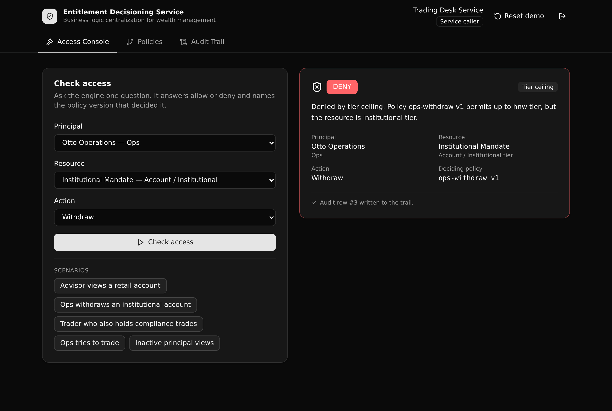

# Entitlement Decisioning Service

One governed API that answers a single question for a wealth firm's internal tools: can this
principal, in this role, take this action on this account? It replies allow or deny, names the exact
policy version that decided it, and writes an audit row.

This is a Xano proof artifact for **Business Logic Centralization** (Play 1) in **wealth management**.
Access rules that would otherwise be copied across ten internal apps live here as versioned data in one
readable layer. Authorization is API-layer RBAC (an auth table, `create_auth_token`, and per-endpoint
role checks), never row-level security.



**6 tables · 10 APIs · 1 function**

## What it demonstrates

- **Rules as versioned data.** Each `entitlement_policies` row is one version of one rule (`policy_key`
  plus `version`, exactly one active at a time). A human can read the active rule set and audit it.
- **A real decision engine.** `check-access` runs a waterfall: baseline grant, then an explicit deny
  policy, then a tier ceiling, then a segregation-of-duty check. It returns the outcome, the rule that
  fired, and the deciding policy version.
- **Versioned logic you can watch flip.** Activate a new version of a policy and the next decision
  changes, while the audit trail keeps the version that decided every past request.
- **API-layer RBAC.** A `policy_admin` curates policies. A `service_caller` may only call the engine. A
  `viewer` is read only. The rules are enforced with per-endpoint preconditions, and a refused call
  returns a 403.

## Repo layout

```
xano/
  index.ts               the workspace, registering everything below
  tables.ts              6 tables (service_accounts, principals, resources,
                         entitlement_policies, grants, access_decisions)
  schema-enums.ts        shared enum vocabularies (roles, actions, tiers, ...)
  functions/tier-rank.ts a helper that ranks account tiers for the ceiling check
  api/groups.ts          5 API groups, each with a pinned canonical slug
  api/*.ts               10 endpoints
frontend/
  src/lib/api.ts         the one contract: paths and types from the query defs
  src/screens/*          Login, Access Console, Policies, Audit Trail
docs/
  index.html             the landing page (served by GitHub Pages)
  screenshot.png         the live app
```

## API surface

| Method | Path | What it enforces |
| --- | --- | --- |
| POST | `/api:eds_auth/login` | Verify a service account and mint a bearer token. |
| POST | `/api:eds_decision/check-access` | The rule engine. Guarded to `service_caller` or `policy_admin`. Writes an audit row. |
| GET | `/api:eds_decision/decisions` | The audit trail, newest first. Any signed-in caller. |
| GET | `/api:eds_decision/decisions/{id}` | One decision joined to the policy version that decided it. |
| GET | `/api:eds_policies/list` | Every policy version, grouped by key. |
| POST | `/api:eds_policies/version` | Create a new draft version. `policy_admin` only. |
| PATCH | `/api:eds_policies/activate/{id}` | Activate a version and retire the prior one. `policy_admin` only. |
| GET | `/api:eds_catalog/principals` | The principals the console picks from. |
| GET | `/api:eds_catalog/resources` | The resources the console picks from. |
| POST | `/api:eds_ops/seed` | Reset the demo data to a known baseline. |

## Quick start

You need a free Xano account. From a clone:

```bash
git clone https://github.com/xano-scratch/entitlement-decisioning-service.git
cd entitlement-decisioning-service
npm install
npx xanots login          # one time, opens a browser to authorize
npm run xano:deploy       # builds the frontend and deploys to a live ephemeral
```

The deploy prints a live backend URL and a static frontend URL. Then seed the demo data:

```bash
curl -X POST "<backend-url>/api:eds_ops/seed"
```

Open the frontend URL and sign in with one of the demo accounts (also listed on the login screen):

| Role | Email | Password |
| --- | --- | --- |
| policy_admin | `admin@wealthfirm.example` | `admin-demo-pass` |
| service_caller | `service@wealthfirm.example` | `service-demo-pass` |
| viewer | `viewer@wealthfirm.example` | `viewer-demo-pass` |

Add `?demo=1` to the frontend URL to auto-run a scenario and land on a governed result.

## Try the money shot

1. Sign in as the `service_caller`. On the console, run "Ops withdraws an institutional account". It is
   denied by the tier ceiling on `ops-withdraw v1`.
2. Sign in as the `policy_admin`. On the Policies screen, create a new version of `ops-withdraw` with the
   effect set to deny, then activate it.
3. Back on the console, re-run an ops withdrawal. It now returns deny, decided by `ops-withdraw v2`. The
   audit trail keeps both decisions with the version that decided each.

## FAQ

**Is authorization row-level security?** No. Every rule is enforced at the API layer with per-endpoint
role checks. There is no row-level security anywhere in this project.

**Where do the rules live?** In the `entitlement_policies` table as versioned rows. The engine reads
them at request time, so changing a rule is a data change, not a code change.

**Does it need any external services?** No. It runs entirely on seeded data with native Xano auth. There
are no third-party credentials.

**Are the demo passwords real secrets?** No. They are throwaway credentials for a disposable environment
and are shown on the login screen on purpose.

## Notes

This is a scratch proof artifact, not a production customer reference. `xano/xano.lock` is committed so
object identities and public paths stay stable across deploys.
